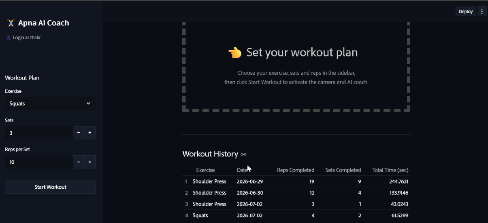
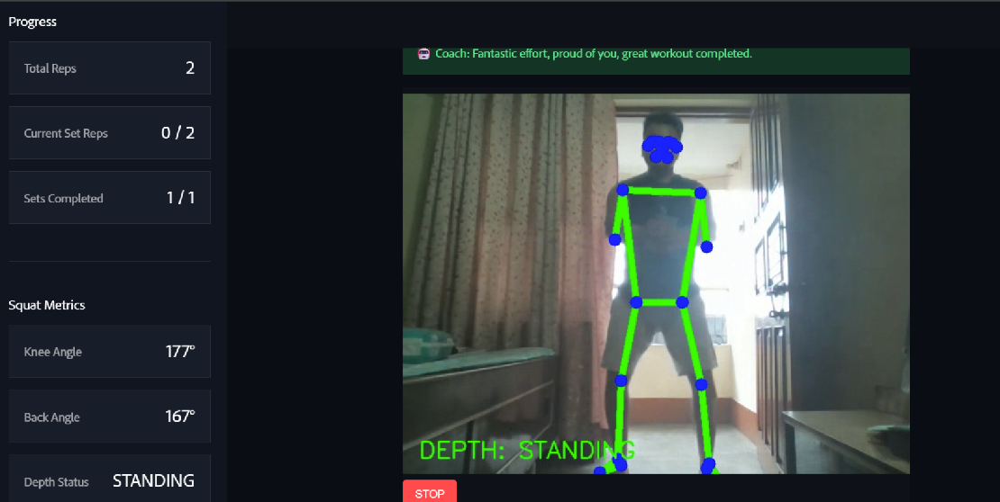
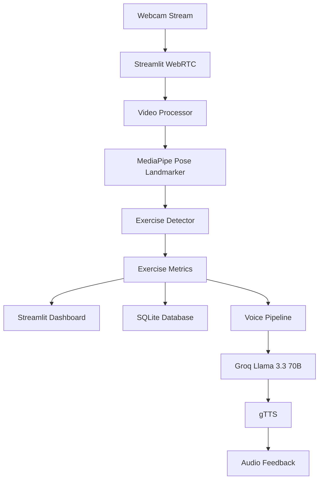

# 🏋️ AI Real-Time Gym Coach

An AI-powered fitness coaching application that combines **real-time pose estimation**, **exercise form analysis**, **intelligent repetition tracking**, and **LLM-powered voice feedback** to provide an interactive workout experience. The application analyzes exercise-specific body mechanics, delivers corrective coaching in real time, and records workout history for progress tracking.


---

# 🌐 Live Demo

🔗 **Live Application:**  
https://ai-realtimegymcoach.streamlit.app/

---

# 🎥 Demo

> **Note:** This demo video is muted for easier viewing. In the live application, AI-generated voice coaching is played automatically based on workout events and detected form issues.

https://github.com/user-attachments/assets/63cc43ee-aad1-4cd4-92fd-ddfcc51d1b17
---

# 📸 Screenshots

### 🏠 Workout Dashboard

Configure your workout, select the exercise, define sets and repetitions, and review previous workout history.



---

### 🏋️ Real-Time Pose Analysis

Live pose estimation with MediaPipe, exercise-specific metrics, repetition tracking, and AI-generated coaching feedback.



---

# ✨ Features

## 🏋️ Real-Time Exercise Tracking

Supports live analysis for multiple exercises:

- Squats
- Push-ups
- Biceps Curls
- Shoulder Press
- Lunges

Each exercise is implemented using an independent detector with its own movement logic and validation rules.

---

## 🎯 Exercise Form Analysis

Instead of only counting repetitions, the application evaluates exercise quality using exercise-specific biomechanical metrics.

Examples include:

### Squats

- Knee Angle
- Back Angle
- Squat Depth

### Push-ups

- Elbow Angle
- Body Alignment
- Hip Position

### Biceps Curls

- Elbow Angle
- Shoulder Stability
- Swing Detection

### Shoulder Press

- Elbow Extension
- Back Arch Detection

### Lunges

- Front Knee Angle
- Torso Angle
- Balance Monitoring

---

## 🔢 Intelligent Rep & Set Tracking

The application automatically tracks:

- Total repetitions
- Current set progress
- Completed sets
- Workout completion

Repetitions are counted using exercise-specific movement states instead of frame counting, reducing false detections.

---

## 🔊 AI Voice Coaching

An event-driven coaching pipeline provides real-time spoken feedback throughout the workout.

Supported coaching events include:

- Workout Started
- Set Completed
- Workout Completed
- Workout Ended Early
- Form Correction
- No Pose Detected

Feedback is generated using **Groq's Llama 3.3 70B** model and converted into speech using **gTTS**.

---

## 📈 Workout Progress Tracking

The dashboard updates continuously during a workout, displaying:

- Live repetition count
- Current set progress
- Exercise-specific metrics
- Workout completion status

Visual overlays are rendered directly on the webcam feed for instant feedback.

---

## 📊 Workout History

Workout sessions are stored locally using SQLite.

Each record contains:

- Exercise Name
- Repetitions
- Completed Sets
- Workout Duration
- Date

Daily workouts for the same exercise are automatically aggregated.

---

## 👤 User Profiles

The application supports lightweight username-based user identification, allowing each user to maintain an independent workout history.

> **Note:** This is designed for personalized workout tracking and does **not** implement password-based authentication.

---

# 🏗️ System Architecture



---

# 🔄 Workout Processing Workflow

```text
User Starts Workout
        │
        ▼
Webcam Stream
        │
        ▼
MediaPipe Pose Detection
        │
        ▼
Exercise-Specific Detector
        │
        ▼
Joint Angle Calculation
        │
        ▼
Rep Counting & Form Analysis
        │
        ├────────► Dashboard Updates
        │
        ├────────► SQLite Workout History
        │
        └────────► AI Voice Coaching
```
# 🚀 Engineering Highlights

- Built a **modular detector architecture**, where each exercise has an independent detector implementing its own movement logic while inheriting from a common abstract base class.
- Implemented **custom joint-angle computation** using vector mathematics and dot products instead of relying on external pose-analysis libraries.
- Designed a **real-time video processing pipeline** using **Streamlit WebRTC**, enabling live webcam streaming with minimal latency.
- Developed an **event-driven AI coaching pipeline** that generates contextual workout feedback using **Groq's Llama 3.3 70B** model and converts responses into speech with **gTTS**.
- Added **thread-safe synchronization** between the video processing pipeline and the Streamlit UI to ensure consistent real-time metric updates.
- Implemented **exercise-specific state machines** for reliable repetition counting and reduced false detections.
- Designed a **modular service-based architecture**, separating vision processing, AI coaching, persistence, tracking, configuration, and UI logic for improved maintainability.
- Persisted workout history using **SQLite**, automatically aggregating daily workout statistics for each user.

---

# 🛠️ Tech Stack

| Category | Technologies |
|----------|--------------|
| Frontend | Streamlit |
| Real-Time Streaming | Streamlit WebRTC |
| Computer Vision | MediaPipe Pose Landmarker (Tasks API), OpenCV |
| AI Model | Groq API (Llama 3.3 70B Versatile) |
| Text-to-Speech | gTTS |
| Database | SQLite |
| Data Processing | Pandas |
| Environment Management | python-dotenv |

---


# 📁 Project Structure

```text
AI_REALTIME_GYM_COACH/
│
├── assets/                         # Demo video & README screenshots
│
├── main_app/
│   ├── main.py                     # Application entry point
│   │
│   ├── core/                       # Base exercise abstraction
│   ├── detectors/                  # Exercise-specific exercise detection
│   ├── ml_models/                  # MediaPipe Pose Landmarker model
│   │
│   ├── services/
│   │   ├── auth/                   # Username-based user management
│   │   ├── coaching/               # LLM & voice coaching pipeline
│   │   ├── config/                 # Application configuration
│   │   ├── persistence/            # SQLite database operations
│   │   ├── state/                  # Streamlit session state management
│   │   ├── tracking/               # Live workout metrics synchronization
│   │   ├── ui/                     # UI components & styling
│   │   └── vision/                 # Real-time video processing
│   │
│   ├── static/                     # Fonts & UI assets
│   └── .env                        # Environment variables
│
├── data.db                         # SQLite database
├── requirements.txt                # Python dependencies
├── packages.txt                    # System dependencies
├── .gitignore
└── README.md
```

---

## ⭐ If you found this project interesting, feel free to ⭐ the repository!
